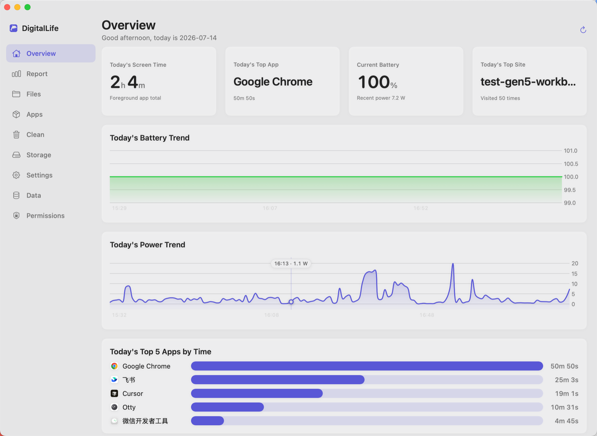
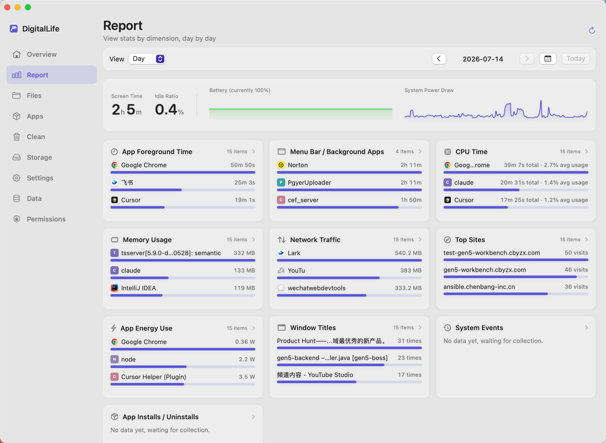
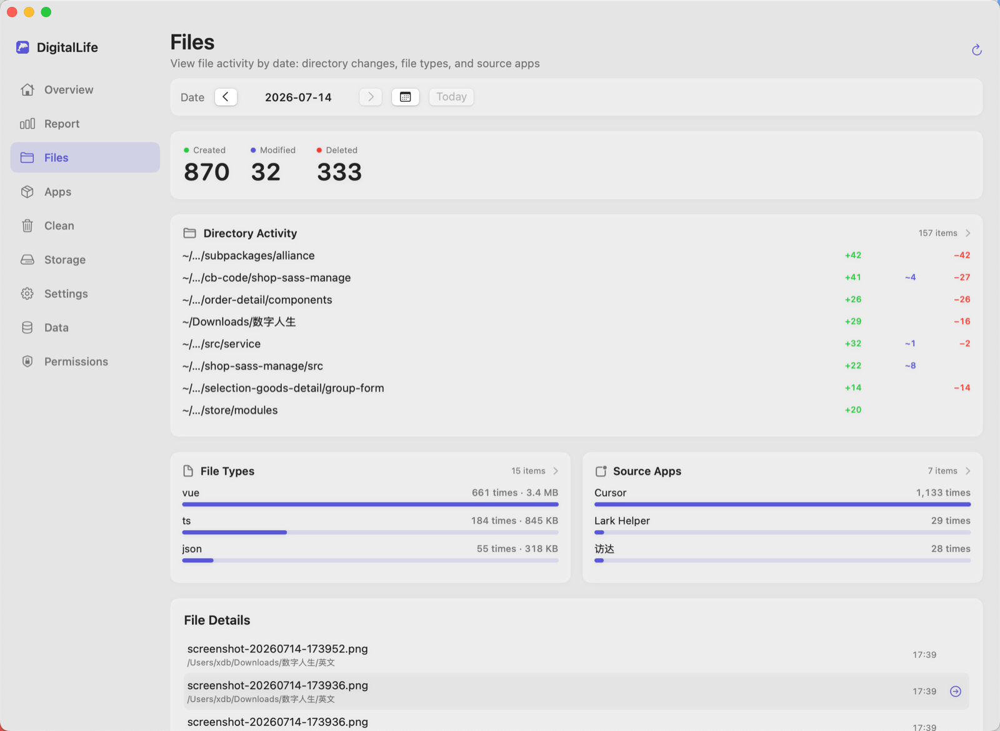
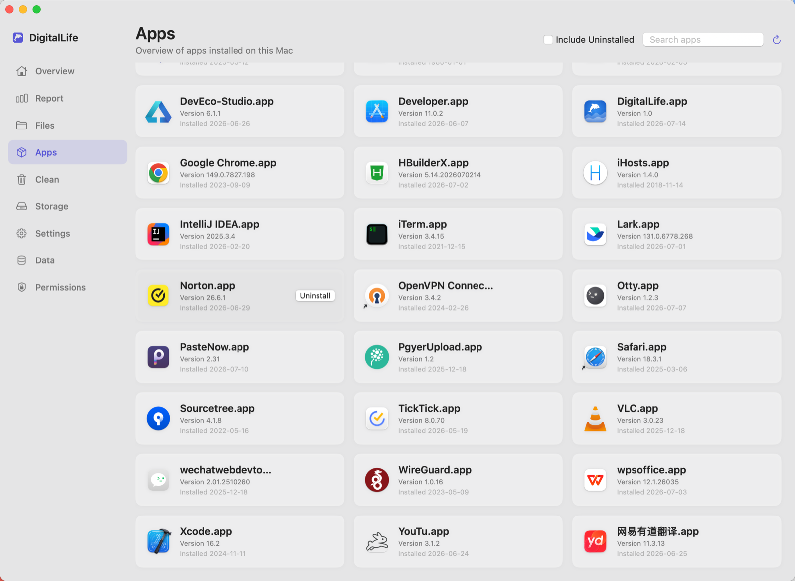
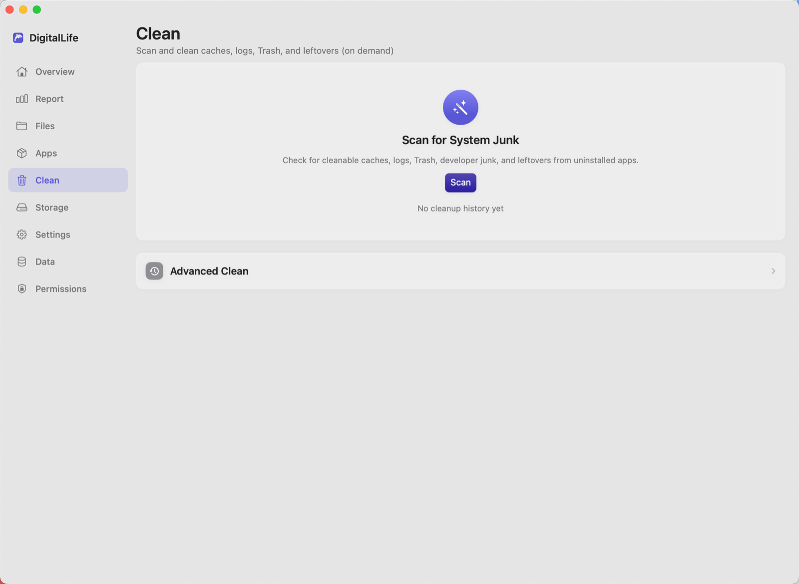
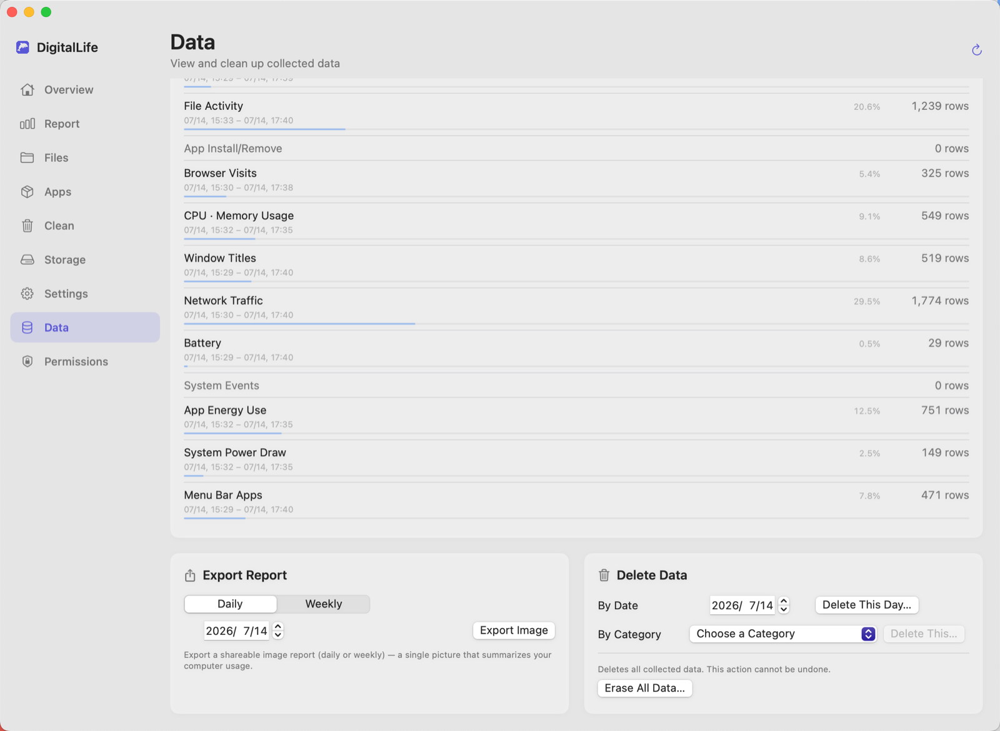

# digitallife（数字人生）

[English](README.md) · [简体中文](README.zh.md) · [日本語](README.ja.md) · [한국어](README.ko.md) · [Français](README.fr.md) · **Deutsch** · [Español](README.es.md) · [Português](README.pt.md)

> Ein nativer macOS-Aktivitätsmonitor —— **alle deine Daten bleiben auf deinem eigenen Mac.**

digitallife zeichnet unauffällig auf, was auf deinem Mac täglich passiert: welche Apps du wie lange nutzt, Netzwerk- und Akku-/Energieverbrauch, Dateiänderungen, installierte und deinstallierte Apps … und stellt alles über eine elegante native Menüleisten-App als übersichtliche Tages-/Wochen-/Monatsberichte dar. Keine Cloud, kein Konto, nichts wird hochgeladen.

---

## 📸 Screenshots

  
  

  
  

  
  

---

## ✨ Was du sehen kannst

- **App-Nutzungsdauer** und tägliche Ranglisten (mit App-Symbolen)
- **Akku- und Energietrends**, Energieverbrauch pro App (optional)
- **Netzwerkverkehr** pro App
- **Dateiaktivität**: erstellt / gelöscht / geändert —— Ordner, Typ und verursachende App
- **CPU-/Speicher**-Bestenliste
- **Fenstertitel und Leerlaufzeit**, Menüleisten- / im Hintergrund laufende Apps
- Verlauf der App-**Installation / Deinstallation**
- **Speicherplatz-Scan** (Auffinden großer Ordner / Dateien) und **Bereinigung unnötiger Dateien**
- **Tages-/Wochen-/Monatsberichte**, Bildschirmzeit im Vergleich zum Vorzeitraum
- Daten lassen sich nach Tag / Kategorie löschen, mit **JSON-/CSV-Export**

---

## 💻 Systemvoraussetzungen

- **macOS 13 (Ventura) oder neuer**
- **Apple Silicon** (M-Serie-Chip)

---

## ⬇️ Download und Installation

1. Lade die neueste `DigitalLife-<Version>.dmg` von **[Releases](https://github.com/Link-X/digitallife-releases/releases/latest)** herunter
2. Öffne das DMG und **ziehe „数字人生“ in „Programme“**
3. **Zum Starten doppelklicken** —— die App ist **von Apple notarisiert**, daher gibt es keine „beschädigt“- / „Entwickler nicht verifiziert“-Blockade und kein „Rechtsklick → Öffnen“ nötig
4. Öffne nach dem ersten Start „权限设置…“ (Berechtigungen) aus der Menüleiste und erteile die Systemberechtigungen wie angeleitet

### Berechtigungen (nach Bedarf erteilen; fehlt eine, wird nur die betreffende Funktion eingeschränkt, sonst nichts)

| Berechtigung | Zweck |
|------|------|
| Vollständiger Festplattenzugriff | Browserverlauf usw. |
| Bedienungshilfen | Vordergrund-App erkennen |
| Bildschirmaufnahme | Fenstertitel lesen (**keine Screenshots**) |
| Automation (Systemereignisse) | Vordergrund-App / -Fenster |

---

## 🔒 Datenschutz

Das liegt digitallife am meisten am Herzen:

- **100 % deiner Daten bleiben lokal**, gespeichert in einer Datenbank auf deinem eigenen Mac, **ohne jegliche Netzwerkübermittlung**
- **Die einzige Netzwerkanfrage** erfolgt, wenn du **manuell auf „Nach Updates suchen“ klickst** —— sie ruft nur eine Versionsnummer ab und sendet keine deiner Daten; ansonsten ist die App vollständig offline
- Für stärkeren Schutz kannst du in den Einstellungen die **Datenbankverschlüsselung** aktivieren (der Schlüssel wird im Schlüsselbund des Systems gespeichert)

---

## 🔄 Nach Updates suchen

App-Menü **„关于数字人生“ (Über) → „检查更新“ (Nach Updates suchen)**: einmal manuell klicken; gibt es eine neuere Version, wirst du mit einem Download-Link benachrichtigt. Kein Hintergrund-Polling, kein automatischer Download.

---

## 📄 Lizenz

**Proprietäre Software · Alle Rechte vorbehalten (All Rights Reserved)** — Copyright © 2026 许道斌 (Daobin Xu).

- **Der Quellcode ist geschlossen**: Außer dem Autor ist ohne vorherige schriftliche Genehmigung keine Nutzung, Vervielfältigung, Änderung, Rückentwicklung oder Verbreitung des Quellcodes gestattet. **„Sichtbar“ bedeutet nicht „nutzbar“.**
- **Offizielle App für nicht kommerzielle Nutzung kostenlos**: Privatpersonen (Lernen / Forschung / Hobby), gemeinnützige Organisationen, Bildungs- und Forschungseinrichtungen sowie Behörden dürfen die offiziell in diesem Repository veröffentlichte, unveränderte, signierte und notarisierte App **kostenlos nutzen**.
- **Offizieller Kanal, nur Eigennutzung**: Lade sie aus den [Releases](https://github.com/Link-X/digitallife-releases/releases/latest) dieses Repositories für deinen eigenen Gebrauch herunter; **Weiterverbreitung, Weitergabe, Vervielfältigung, Änderung und Rückentwicklung sind untersagt.**
- **Kommerzielle Nutzung erfordert eine Genehmigung**: Jede kommerzielle Nutzung —— **einschließlich der Nutzung durch eine gewinnorientierte Organisation (Unternehmen / Firma) im Rahmen ihrer Geschäftstätigkeit, selbst zur rein internen Nutzung durch ihre Mitarbeiter** —— erfordert eine vorherige schriftliche Genehmigung.

> „Nicht kommerziell“ bezeichnet eine Nutzung, die nicht primär auf kommerziellen Vorteil oder geldwerte Vergütung ausgerichtet ist: private Nutzung, gemeinnützige Organisationen, Bildungs- und Forschungseinrichtungen sowie Behörden im Rahmen ihrer gemeinnützigen / öffentlichen Aufgaben.

Bei Lizenzanfragen wende dich an **许道斌 (Daobin Xu)** (<15555537368xu@gmail.com>). Die vollständigen zweisprachigen Bedingungen findest du in [LICENSE](LICENSE).
